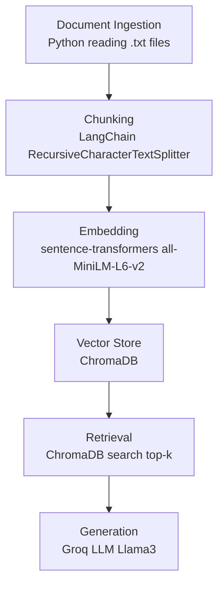

# Project 1 Planning: The Unofficial Guide

> Write this document before you write any pipeline code.
> Your spec and architecture diagram are what you'll use to direct AI tools (Claude, Copilot, etc.) to generate your implementation — the more specific they are, the more useful the generated code will be.
> Update the Retrieval Approach and Chunking Strategy sections if you change your approach during implementation.
> Update this file before starting any stretch features.

---

## Domain

Student course reviews at the University of Waterloo. This knowledge is valuable because official course syllabi and university descriptions rarely reflect the true difficulty, real workload, helpfulness of professors, or the "hidden rules" of a course (e.g., relying on past test banks or the necessity of office hours). This honest, subjective feedback is hard to find systematically except through scattered student forums or word-of-mouth.

---

## Documents

<!-- List your specific sources: URLs, subreddit names, forum threads, or file descriptions.
     Aim for at least 10 sources that together cover different subtopics or perspectives within your domain. -->

| # | Source | Description | URL or location |
|---|--------|-------------|-----------------|
| 1 | UWFlow MATH 135 Reviews | MATH 135: Algebra for Honours Mathematics | `documents/uwflow_math135_reviews.txt` |
| 2 | UWFlow ECON 101 Reviews | ECON 101: Introduction to Microeconomics | `documents/uwflow_econ101_reviews.txt` |
| 3 | UWFlow MATH 137 Reviews | MATH 137: Calculus 1 for Honours Mathematics | `documents/uwflow_math137_reviews.txt` |
| 4 | UWFlow CS 135 Reviews | CS 135: Designing Functional Programs | `documents/uwflow_cs135_reviews.txt` |
| 5 | UWFlow ENGL 109 Reviews | ENGL 109: Introduction to Academic Writing | `documents/uwflow_engl109_reviews.txt` |
| 6 | UWFlow STAT 230 Reviews | STAT 230: Probability | `documents/uwflow_stat230_reviews.txt` |
| 7 | UWFlow PD 1 Reviews | PD 1: Career Fundamentals | `documents/uwflow_pd1_reviews.txt` |
| 8 | UWFlow SPCOM 223 Reviews | SPCOM 223: Public Speaking | `documents/uwflow_spcom223_reviews.txt` |
| 9 | UWFlow MATH 239 Reviews | MATH 239: Introduction to Combinatorics | `documents/uwflow_math239_reviews.txt` |
| 10 | UWFlow CHEM 120 Reviews | CHEM 120: General Chemistry 1 | `documents/uwflow_chem120_reviews.txt` |

---

## Chunking Strategy

<!-- How will you split documents into chunks?
     State your chunk size (in tokens or characters), overlap size, and explain why those
     numbers fit the structure of your documents.
     A review-heavy corpus warrants different chunking than a long FAQ. -->

**Chunk size:** 500 characters

**Overlap:** 50 characters

**Reasoning:** Since the documents are primarily student reviews, most insights or opinions are concisely stated in 1-3 sentences. A chunk size of 500 characters ensures that single thoughts and standalone reviews remain largely intact without diluting the semantic meaning with too many topics at once. A 50-character overlap helps maintain grammatical context and reference continuity across sentences that might straddle a boundary.

---

## Retrieval Approach

<!-- Which embedding model are you using (e.g., all-MiniLM-L6-v2 via sentence-transformers)?
     How many chunks will you retrieve per query (top-k)?
     If you were deploying this for real users and cost wasn't a constraint, what tradeoffs
     would you weigh in choosing a different embedding model — context length, multilingual
     support, accuracy on domain-specific text, latency? -->

**Embedding model:** `all-MiniLM-L6-v2` via `sentence-transformers`

**Top-k:** 5

**Production tradeoff reflection:** 
If cost and scale weren't limits, I might evaluate switching to a model like `text-embedding-3-small` or `text-embedding-3-large` (OpenAI), or an advanced dense retriever specialized in domain adaptation. I'd weigh factors like:
- **Context length:** Models capable of reading 8k+ tokens effectively in one pass could reduce chunking requirements entirely, though it might increase LLM synthesis time.
- **Accuracy on Domain/Slang text:** Student reviews use heavy acronyms (e.g., "cs135", "MATH", "PD", "marks", "curve"). Better pre-trained contextual embeddings for academic slang would aid retrieval.
- **Latency:** More complex embeddings incur a higher cost and slower retrieval. Since we only need to search locally hosted unstructured text, staying with efficient local models keeps latency consistently low.

---

## Evaluation Plan

<!-- List your 5 test questions with their expected correct answers.
     Questions should be specific enough that you can judge whether the system's response
     is right or wrong. "What are good dining halls?" is too vague.
     "What do students say about wait times at [dining hall name] during lunch?" is testable. -->

| # | Question | Expected answer |
|---|----------|-----------------|
| 1 | Is ECON 101 considered a heavy workload course? | No, reviews emphasize it is remarkably easy/bird course if you read the textbook or use test banks. |
| 2 | Do students find the textbook necessary for MATH 135? | Yes, many reviews suggest you MUST do textbook practice problems to pass the assessments. |
| 3 | How do students generally feel about taking PD 1? | Universally disliked. Often described as useless, a waste of time, or tedious "busy work". |
| 4 | What is the main difficulty associated with CS 246? | The assignments. They are very long, heavy, and strict on C++ memory management and design patterns. |
| 5 | Does CHEM 120 involve a lot of new concepts compared to high school chemistry? | No, multiple reviews mention it feels like a repeat or direct continuation of Grade 12 Chemistry. |

---

## Anticipated Challenges

<!-- What could go wrong? Name at least two specific risks with reasoning.
     Consider: noisy or inconsistent documents, missing source attribution, off-topic
     retrieval, chunks that split key information across boundaries. -->

1. **Missing Source Attribution in Chunks:** When a review is chunked, the name/course ID at the top of the document might be lost if it's not injected into the chunks. For example, a chunk might say "the assignments are terrible," but the LLM won't know if that's about MATH 135 or CS 246. To fix this, I need to reliably prepend the course name to chunks.

2. **Noisy/Conflicting Reviews:** Because reviews are subjective, one chunk might say "Prof X is great," while another says "Prof X is awful." If the retrieval returns conflicting points, the LLM might hallucinate a middle ground instead of accurately portraying the polarizing student sentiment.

---

## Architecture

---

## AI Tool Plan

<!-- For each part of the pipeline below, describe:
     - Which AI tool you plan to use (Claude, Copilot, ChatGPT, etc.)
     - What you'll give it as input (which sections of this planning.md, which requirements)
     - What you expect it to produce
     - How you'll verify the output matches your spec

     "I'll use AI to help me code" is not a plan.
     "I'll give Claude my Chunking Strategy section and ask it to implement chunk_text()
     with my specified chunk size and overlap" is a plan. -->

**Milestone 3 — Ingestion and chunking:**
I will prompt Copilot (or ChatGPT) with the *Chunking Strategy* section and the *Architecture* diagram to generate the Python code using `RecursiveCharacterTextSplitter`. I expect it to output a function that successfully loads the `.txt` files from `documents/` and outputs a list of string chunks containing the course name prepended to them (from my Anticipated Challenges analysis).

**Milestone 4 — Embedding and retrieval:**
I will give Copilot my *Retrieval Approach* and ask it to initialize a ChromaDB collection and use `sentence-transformers`'s `all-MiniLM-L6-v2` model to embed my chunks. I expect a script that loops over the chunks, stores them in Chroma, and provides a simple function to query the top 5 nearest neighbors given a user question.

**Milestone 5 — Generation and interface:**
I will prompt Claude/Copilot with my setup and ask it to integrate the `Groq` API using LLaMA-3. I'll provide the specific instructions from the Milestone 5 setup and the outputs of my retrieval logic, requesting a CLI loop or chat function that passes the retrieved context as a system prompt to answer the user's questions definitively.
